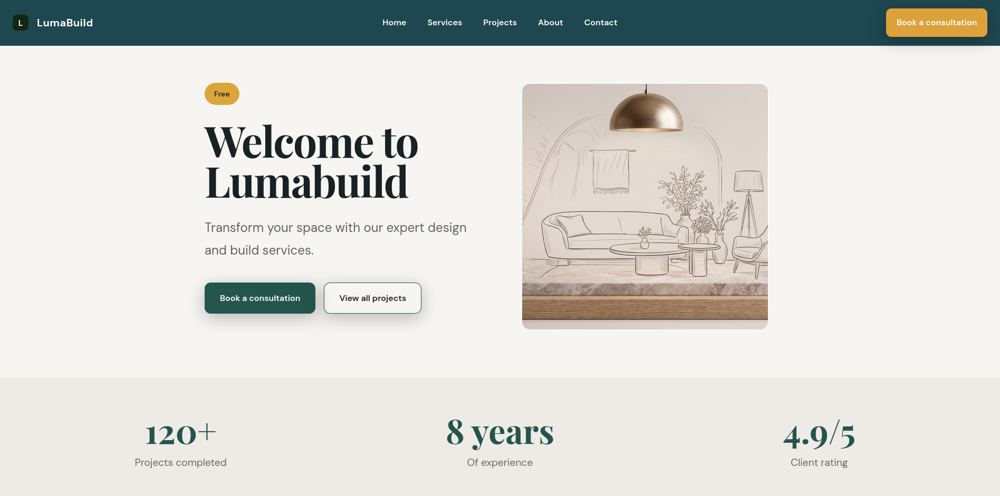

# LumaBuild

A responsive React concept website for a fictional interior design and renovation studio.



## 🎯 Live Demo

> Add your deployed URL here when ready

## ✨ Features

- **Fully Responsive Design** - Optimized for mobile (320px+), tablet (768px+), and desktop (1024px+)
- **React Router Navigation** - Smooth single-page application experience
- **TypeScript Throughout** - Type-safe codebase with strict typing
- **Modern Design System** - CSS variables, custom properties, and consistent styling
- **Scroll Reveal Animations** - Intersection Observer-based animations
- **Project Lightbox** - Click to view project details in fullscreen
- **Validated Contact Form** - Client-side validation with error handling
- **Accessibility Focused** - ARIA labels, keyboard navigation, focus states
- **Performance Optimized** - Lazy loading images, optimized assets
- **SEO Ready** - Meta tags, Open Graph, semantic HTML

## 🛠 Tech Stack

- **React 19.2.8** - Latest React with modern hooks
- **TypeScript 6.0.2** - Static typing for better DX
- **Vite 8.3.0** - Lightning-fast dev server and build tool
- **React Router DOM 7.18.4** - Client-side routing
- **Oxlint** - Fast Rust-based linting
- **CSS3** - Modern CSS with custom properties

## 📁 Project Structure

```
LumaBuild/
├── src/
│   ├── components/        # Reusable components
│   │   ├── Header.tsx     # Navigation header
│   │   ├── Footer.tsx     # Footer with links
│   │   ├── Counter.tsx    # Animated number counter
│   │   ├── Lightbox.tsx   # Image lightbox modal
│   │   └── ScrollReveal.tsx # Scroll animation wrapper
│   ├── pages/            # Page components
│   │   ├── Home.tsx      # Landing page
│   │   ├── Services.tsx  # Services showcase
│   │   ├── Projects.tsx  # Project portfolio
│   │   ├── About.tsx     # Process steps
│   │   ├── Contact.tsx   # Contact form
│   │   └── NotFound.tsx  # 404 page
│   ├── data/             # TypeScript data files
│   │   ├── projectsData.ts
│   │   └── servicesData.ts
│   ├── assets/           # Images and SVGs
│   ├── App.tsx           # Root component
│   ├── main.tsx          # Entry point
│   └── index.css         # Global styles
├── public/               # Static assets
└── package.json
```

## 🚀 Installation & Development

```bash
# Install dependencies
npm install

# Start development server
npm run dev

# Build for production
npm run build

# Preview production build
npm run preview

# Run linter
npm run lint

```
## 🚀 Quick Start Docker Edition

### Development (Hot Reload)

```bash
docker compose -f docker-compose.dev.yml up --build
# Access at http://localhost:5173
```

### Production

```bash
docker build -t lumabuild:latest .
docker run -d -p 80:80 --name lumabuild lumabuild:latest
# Access at http://localhost:80
```

## 🏗️ Architecture

### Production Build Pipeline

Multi-stage build reduces image from 500MB to 50MB:

```
Stage 1: Builder (Node 22 Alpine)
├─ npm install
├─ npm run build
└─ Output: dist/

Stage 2: Runtime (Nginx Alpine)  
├─ Copy dist/
├─ Configure Nginx
└─ Serve files

Result: ~50MB optimized image
```
> For more information about the Docker Setup
> [Read the setup guide](DOCKER_SETUP.md)

## 📱 Responsive Breakpoints

The design is optimized for these breakpoints:

- **Mobile**: 320px, 375px, 390px
- **Tablet**: 768px
- **Laptop**: 1024px
- **Desktop**: 1440px+

## ♿ Accessibility Features

- Semantic HTML5 elements
- ARIA labels and roles
- Keyboard navigation support
- Focus visible styles
- Alt text for all images
- Form labels and error messages
- Skip to content link
- Color contrast compliant

## 🎨 Design System

The project uses a comprehensive design system with CSS variables:

### Colors
- Primary: `#1f5558` - Deep teal
- Accent: `#e4a72c` - Warm gold
- Background: `#f7f5f0` - Soft cream
- Text: `#182124` - Near black

### Typography
- Headings: Playfair Display (serif)
- Body: DM Sans (sans-serif)
- Responsive scaling with `clamp()`

### Components
- Consistent spacing scale
- Reusable button styles
- Form validation patterns
- Animation utilities

## ⚠️ Important Note

**This is a fictional portfolio project.**

- Brand name "LumaBuild" is created for demonstration purposes
- All project images, statistics, and testimonials are fictional
- Contact information is placeholder data (no actual email/phone)
- The contact form is client-side only (no backend)
- Project locations and details are conceptual examples

This project demonstrates modern React development practices, responsive design, accessibility standards, and TypeScript usage.

## 📄 License

This is a practice/portfolio project. Feel free to use it as inspiration for your own work.

## 🤝 Contributing

This is a demonstration project, but suggestions and improvements are welcome!

## 📸 Screenshots

> Add screenshots here showing:
> - Desktop homepage
> - Mobile responsive view
> - Contact form validation
> - Project lightbox
> - Services grid

---

**Built with ❤️ as a demonstration of modern web development practices**

